# Universal Image Enhancer ✨

**Transform any photo into a stunning, AI-enhanced masterpiece in seconds**

<div align="center">

[](https://uie.hjlabs.in)
[](https://opensource.org/licenses/MIT)
[](https://php.net)
[](https://ai.google.dev)

**[🚀 Try Live Demo](https://uie.hjlabs.in) • [📖 Documentation](#documentation) • [🛠️ Installation](#installation) • [🤝 Contributing](#contributing)**

</div>

---

## 🎯 What is Universal Image Enhancer?

Universal Image Enhancer is a powerful, privacy-focused web application that uses Google's Gemini AI to transform your photos with just three simple steps. From subtle improvements to fantasy reimaginings, create stunning visuals without any technical expertise.

### ✨ Key Features

- **🎛️ 5 Enhancement Levels** - From subtle touch-ups to complete artistic transformations
- **⚡ Instant Processing** - See results in seconds with our optimized workflow  
- **🔒 Privacy First** - Images processed once by Google AI, never stored on our servers
- **📱 Mobile Responsive** - Works seamlessly on phone, tablet, and desktop
- **📈 Enhancement History** - Keep track of your last 30 transformations locally
- **🎨 Side-by-Side Comparison** - Compare original vs enhanced instantly
- **💾 One-Click Download** - Save enhanced images in original quality
- **🔓 Open Source** - MIT licensed, fork and customize freely

---

## 🖼️ See It In Action

<div align="center">


</div>

---

## 🚀 Live Demo

**Experience the power of AI image enhancement instantly:**

### **[🌐 Try Universal Image Enhancer →](https://uie.hjlabs.in)**

*No registration required • No watermarks • Privacy focused*

---

## 🛠️ Installation & Setup

### Prerequisites
- **PHP 7.4+** (built-in development server works fine)
- **50MB+ free disk space** for application files
- **Google Gemini API Key** ([Get yours free here](https://aistudio.google.com/apikey))

### Quick Start (60 seconds)

```bash
# 1. Clone the repository
git clone https://github.com/your-github-username/Universal-Image-Enhancer.git
cd Universal-Image-Enhancer

# 2. Start PHP development server
php -S localhost:8000

# 3. Open in your browser
open http://localhost:8000
```

### First Time Setup

1. **Open the application** in your browser
2. **Click the settings gear icon** in the top-right corner  
3. **Enter your Gemini API Key** ([Get one here](https://aistudio.google.com/apikey))
4. **Select your preferred model** from the dropdown
5. **Click "Save Settings"** and start enhancing!

---

## 📚 How It Works

### The Magic Behind the Scenes

```mermaid
graph TD
    A[📷 Upload Image] --> B[🔧 Client-side Optimization]
    B --> C[🚀 Send to Gemini AI]
    C --> D[🎨 AI Enhancement Processing]
    D --> E[📊 Side-by-side Results]
    E --> F[💾 Local History Storage]
    E --> G[⬇️ Download Enhanced Image]
```



### Enhancement Levels Explained

| Level | Description | Best For |
|-------|-------------|----------|
| **1 - Subtle** | Minor lighting and contrast adjustments | Professional photos, portraits |
| **2 - Enhance** | Noticeable color vibrancy and detail improvements | Everyday photos, social media |  
| **3 - Creative** | Clear transformations with artistic filters | Creative projects, artistic expression |
| **4 - Artistic** | Significant style changes (painterly, abstract) | Art creation, unique interpretations |
| **5 - Fantasy** | Complete reimagining with surreal elements | Fantasy art, creative experiments |

---

## 🔧 Technical Architecture

### Tech Stack
- **Frontend**: Vanilla HTML5, CSS3, ES6 JavaScript (zero framework dependencies)
- **Backend**: Single PHP file with JSON API endpoint
- **AI Engine**: Google Gemini Vision API with `generateContent`
- **Styling**: TailwindCSS via CDN with custom properties
- **Icons**: Inline SVG (no external dependencies)
- **Storage**: Client-side `localStorage` for settings and history

### Performance Features
- **Client-side image resizing** for files over 4MB
- **Optimized thumbnail storage** (~30KB each for history)
- **Efficient caching** with 30-item rolling history
- **Responsive design** with mobile-first approach

---

## 🔧 Configuration & Customization

### Environment Variables
Create a `.env` file for production deployments:
```env
GEMINI_API_KEY=your_api_key_here
MAX_FILE_SIZE=50M
HISTORY_LIMIT=30
```

### Customization Options

#### **Enhancement Prompts**
Edit the `$prompts` array in `index.php` to customize AI behavior:
```php
$prompts = [
    1 => "Your custom subtle enhancement prompt...",
    2 => "Your custom enhancement prompt...",
    // ... customize all 5 levels
];
```

#### **UI Styling**
Modify CSS custom properties in the `<style>` block:
```css
:root {
    --primary-gradient: linear-gradient(135deg, #667eea 0%, #764ba2 100%);
    --accent-color: #6366f1;
    --max-history: 30; /* Change history limit */
}
```

#### **API Models**
The application automatically detects and lists available Gemini models. Add support for new models when Google releases them by updating the `fetchModels()` function.

---

## 🐛 Troubleshooting

### Common Issues & Solutions

| Problem | Symptoms | Solution |
|---------|----------|----------|
| **Large File Upload Errors** | HTTP 413/500 errors | Increase `upload_max_filesize` in `php.ini` or let auto-resize handle it |
| **Storage Quota Issues** | `QuotaExceededError` in console | Already optimized with tiny thumbnails (~30KB each) |
| **CORS Errors** | Network request blocked | Host on same origin or use PHP proxy |
| **Long Processing Times** | Timeout on large images | Gemini can take 30-90s for complex images - this is normal |
| **API Key Issues** | Enhancement fails immediately | Verify API key at [Google AI Studio](https://aistudio.google.com/apikey) |

### Debug Mode
Enable debug logging by adding this to your PHP:
```php
ini_set('display_errors', 1);
error_reporting(E_ALL);
```

---

## 🔐 Security & Privacy

### Data Handling
- **Local Processing**: Images resized client-side before upload
- **No Server Storage**: Images processed once by Google AI, never stored locally
- **Secure Transmission**: All API calls use HTTPS encryption
- **Local History**: Thumbnails stored in browser localStorage only
- **API Key Security**: Stored locally in browser, never transmitted to our servers

### Privacy Commitment
- No user tracking or analytics
- No server-side image storage
- No personal data collection
- Full GDPR compliance
- Open source transparency

---

## 🤝 Contributing

We welcome contributions from the community! Here's how to get involved:

### Development Setup
1. **Fork the repository**
2. **Create a feature branch**: `git checkout -b feat/amazing-feature`
3. **Make your changes** and test thoroughly
4. **Commit your changes**: `git commit -m 'Add amazing feature'`
5. **Push to your branch**: `git push origin feat/amazing-feature`
6. **Open a Pull Request** with detailed description

### Contribution Guidelines
- 🐛 **Bug Reports**: Use the issue template and include reproduction steps
- 💡 **Feature Requests**: Open an issue first to discuss implementation
- 📝 **Documentation**: Help improve README, code comments, and guides
- 🧪 **Testing**: Add tests for new features and bug fixes
- 🎨 **UI/UX**: Propose design improvements with mockups

### Development Standards
- Follow existing code style and conventions
- Write meaningful commit messages
- Test on multiple browsers and devices
- Update documentation for new features

---

## 📈 Roadmap

### Upcoming Features
- [ ] **Batch Processing** - Handle multiple images simultaneously
- [ ] **Custom Presets** - Save your own enhancement styles  
- [ ] **Export Formats** - Support for WebP, AVIF, and other formats
- [ ] **Advanced Controls** - Fine-tune specific aspects (brightness, contrast, saturation)
- [ ] **Comparison Slider** - Interactive before/after slider view
- [ ] **Social Sharing** - Direct sharing to social platforms
- [ ] **API Integration** - RESTful API for developers
- [ ] **Docker Support** - Containerized deployment option

### Long-term Vision
- Integration with additional AI models (Stability AI, Midjourney)
- Advanced editing tools and filters
- Collaborative enhancement sharing
- Mobile app versions

---

## 📄 License & Legal

### MIT License
This project is licensed under the MIT License - see the [LICENSE](LICENSE) file for full details.

**TL;DR**: You can use, modify, and distribute this software freely, including for commercial purposes.

### Third-Party Acknowledgments
- **Google Gemini API** - Powering the AI enhancements
- **TailwindCSS** - Providing the utility-first CSS framework
- **Community Contributors** - Making this project better every day

---

## ⭐ Show Your Support

If Universal Image Enhancer has helped you create amazing images, show your support:

- ⭐ **Star this repository** to help others discover it
- 🐛 **Report bugs** and suggest improvements
- 🤝 **Contribute code** or documentation
- 💬 **Share your creations** on social media with `#UniversalImageEnhancer`

---

## 📞 Support & Community

### Need Help?
- 📖 **Documentation**: Check this README and inline code comments
- 🐛 **Bug Reports**: [Open an issue](https://github.com/your-github-username/Universal-Image-Enhancer/issues)
- 💡 **Feature Requests**: [Suggest new features](https://github.com/your-github-username/Universal-Image-Enhancer/discussions)
- 📧 **Contact**: [your-email@domain.com](mailto:your-email@domain.com)

### Stay Updated
- Watch this repository for updates
- Follow [@YourTwitter](https://twitter.com/YourTwitter) for announcements
- Join our [Discord community](https://discord.gg/your-invite) for discussions

---

<div align="center">

## 🌟 Ready to Transform Your Images?

### **[🚀 Try Universal Image Enhancer Now](https://uie.hjlabs.in)**

*Experience the magic of AI-powered image enhancement*

**Made with ❤️ by [Your Name](https://github.com/your-github-username)**

</div>
